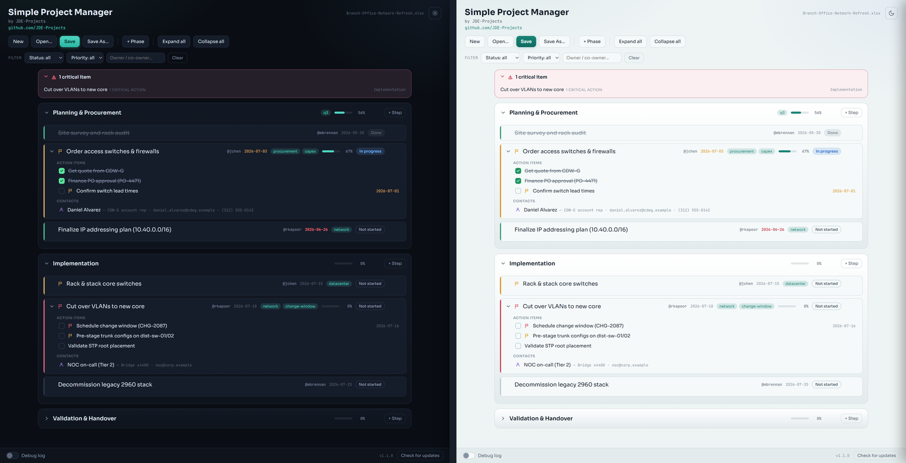

# Simple Project Manager

A standalone desktop tool to plan, track, and manage IT projects as a nested checklist: Phases hold Steps, Steps hold Actions and Contacts. Every item carries an owner and co-owner, a deadline, a status, a priority, tags, and notes, with progress rolling up automatically. Projects are saved as ordinary Excel `.xlsx` files. The interface is a clean web-style window.

Built by [JDE-Projects](https://github.com/JDE-Projects).

If you enjoyed this project and would like to buy me a coffee, check out my [Ko-fi](https://ko-fi.com/jdeprojects).

## Preview
<p align="center">
  
  <br><em>Dark and light themes</em>
</p>

## Highlights

- **Four-level tree.** Phases -> Steps -> Actions (checklist items), with Contacts attached to a step. Each item nests under the nearest parent above it.
- **Excel is the save format.** New / Open / Save / Save As work on `.xlsx` files directly - no separate database. The workbook is human-readable, with the tree indented and Excel row grouping so phases fold up. A silent recovery copy guards unsaved work and offers to restore it on the next launch.
- **Rich per-item detail.** Owner and co-owner, deadline, status (Not started / In progress / Done / Blocked), priority (Low / Normal / High / Critical), colored tags, and notes, edited in a slide-in panel.
- **Automatic progress roll-up.** A step shows the percentage of its ticked actions; a phase averages its steps.
- **At-a-glance signals.** Overdue deadlines turn red and those due within a week turn amber; High and Critical priorities show a colored left bar and flag; a "Critical items" summary sits at the top of the project.
- **Filtering and reordering.** Filter by status, priority, or owner; reorder phases, steps, actions, and contacts with up/down controls. Completed steps gray out and collapse.
- **Dark and light teal themes.** A sun/moon toggle in the header switches between them; your choice is remembered locally.
- **Update check.** Checks the GitHub Releases page and points you to a newer version when one is published.

## How it works

- The backend is a small Python application; project files are read and written with [openpyxl](https://openpyxl.readthedocs.io/).
- The window is a [pywebview](https://pywebview.flowrl.com/) host on the Qt backend (PySide6), with the UI in `simple_project_manager-UI.html`. Fonts (Sora, JetBrains Mono) are bundled locally in `fonts/`, so the look holds with no internet.
- A `.xlsx` you save IS the project file - open it in Excel directly if you like. A hidden `_spm` sheet stores an app marker, schema version, and tag colors; the app only reads the columns it owns and confirms anything unexpected on import.

## Download and run

Two ways to get it from the [Releases](../../releases) page - pick one:

- **Installer (recommended):** download `SimpleProjectManager-vX.Y.Z-setup.exe` and run it. It installs the app, adds a Start menu shortcut, and can be removed later from **Add or Remove Programs**. Installs just for you by default (no admin needed); you can choose all users during setup.
- **Portable .zip:** download `SimpleProjectManager-vX.Y.Z.zip`, extract it, and run `Simple Project Manager.exe` from inside the extracted folder. No install - good for a locked-down PC or a USB stick. Keep the folder together (the app ships as a folder, not a single loose .exe).

Windows only; no Python or setup required. Because it is unsigned, Windows SmartScreen may warn about an unknown publisher the first time. Click **More info > Run anyway**.

## Updating

Simple Project Manager doesn't update itself. The bottom bar has a **Check for updates** button that tells you when a newer release is out; when it does, get the new version from the [Releases](../../releases) page the same way you first installed it.

- **Installer:** download the new `SimpleProjectManager-vX.Y.Z-setup.exe` and run it. It installs over your current copy and keeps your theme choice.
- **Portable .zip:** download and extract the new `SimpleProjectManager-vX.Y.Z.zip`. To keep your theme choice, copy `simple_project_manager.pref` from the old folder into the new one.

Your project `.xlsx` files live wherever you saved them and are untouched by an update. The silent recovery copy (`.spm_recovery.xlsx`) is transient and does not need to be carried over. No secrets are stored, so there's nothing else to carry over.

## Verify this download (optional)

This release was built on GitHub from this public source, not on a personal
machine, and is signed with a build-provenance attestation. To confirm your
download is genuine, install the [GitHub CLI](https://cli.github.com) and run:

```
gh attestation verify SimpleProjectManager-vX.Y.Z.zip \
  --repo JDE-Projects/Simple-Project-Manager \
  --signer-repo JDE-Projects/Build-Tools
```

A `Verification succeeded!` line means the file was built by the published
pipeline from this repo. You can also check the file against the published
`.sha256`.

## Build from source (optional)

If you would rather run or build it yourself, you need:

- **Python 3** on the machine's PATH.
- `pip install -r requirements.txt` (pinned versions; includes `pywebview`, `PySide6`, `qtpy`, `openpyxl`, and `pyinstaller`). Keep `PyQt6` uninstalled so PySide6 is the bundled binding.

Keep `simple_project_manager.py`, `simple_project_manager-UI.html`, the `fonts/` folder, `simple_project_manager.ico`, `simple_project_manager.png` and `simple_project_manager-splash.png` together. Then either:

- **Run from source:** `python simple_project_manager.py`
- **Build the .exe:** double-click `Build_Simple_Project_Manager.bat`, which uses PyInstaller to produce `dist\Simple Project Manager\Simple Project Manager.exe`. Distribute the whole `Simple Project Manager` folder.

## Using it

1. Click **+ Phase** to add a phase, then use the **+ Step** button in a phase header to add steps.
2. Click any item to open its edit panel. Inside a step you manage its action items and contacts, set owners, deadlines, status, priority, tags, and notes.
3. Tick actions as you finish them - progress rolls up to the step and phase automatically.
4. Use the filter bar to focus on a status, priority, or owner, and the up/down controls to reorder.
5. **Save** writes an `.xlsx` you can reopen here or in Excel. **Open** loads one back.

## Security and privacy

- Project `.xlsx` files are ordinary Excel workbooks saved wherever you choose. They may list internal hosts, vendors, and contact details, so keep them out of public source control.
- Your theme choice is stored in a small local preference file next to the app; it is not part of any project file.
- The debug log is off by default. When you turn it on, it writes one `Debug_Log_*.txt` next to the app for that run.

## A note on how this was built

This project was built with AI assistance. The design decisions, feature direction, and real-world testing were directed by me. The code was written and revised with an AI assistant against that direction. Treat it like any community tool: review and test it before relying on it.

## License

Released under the [PolyForm Noncommercial License 1.0.0](LICENSE). Personal and any noncommercial use, modification, and noncommercial redistribution are allowed; commercial use is not. Keep the copyright notice; no warranty.

This build bundles third-party code (Qt via PySide6, pywebview, openpyxl, and the Sora and JetBrains Mono fonts). Their notices are in [THIRD-PARTY-LICENSES.txt](THIRD-PARTY-LICENSES.txt).

For commercial licensing, open a [GitHub issue](https://github.com/JDE-Projects/Simple-Project-Manager/issues) with the title "Commercial License Inquiry".
